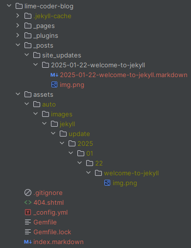

It's been about a week since I started configuring and using [Jekyll][Jekyll] for my blog.

Here is my recount of the development process so far:

<!--more-->

{img-left}


{class="img-right" attrs="controls playsinline"}

To begin, I have to say that I am really impressed with the simplicity of the setup and 
streamline workflow provided by the [Jekyll][Jekyll] framework.

Naturally, there have been hiccups I have had to overcome along the way to get to where I am now.

So while I am still learning the ins and outs of [Jekyll][Jekyll], so far I have been able to get a lot
done with it without too much trouble overall. 

To provide some context, I mentioned in a [previous post][Site Update Jan 18 2025] that I was in the market for a static site generator 
to replace my [old personal blog][mamclain].

I also discussed my preferences for static blog generators and, to a lesser extent, why I decided to leverage the popular 
static blog generator [Jekyll][Jekyll] for this purpose.

**Note: There are a number of static blog generators available, but I picked [Jekyll][Jekyll] because it is 
well-documented, has a large community of users, and it is also [Github Pages][Github Pages] compatible.**

So if you learn [Jekyll][Jekyll], you can also use this knowledge to create nice software documentation.

---

### Installation

{img-left}

The installation process for [Jekyll][Jekyll] is pretty straightforward, 
at least as long as you have [Ruby][Ruby] installed on your system. 

If you have never touched [Ruby][Ruby] before, and terms like [gem][Gem], and [bundle][Bundler] are foreign to you, 
you might be in for a bit of a learning curve to get started.

For most developers in the full-stack web development space, [Ruby][Ruby] tends to accompany other
technologies like [Node.js][nodejs], so if you are interested in full-stack web development, you should really
learn about these technologies.

For the sake of brevity, I will not go into significant depth about getting [Ruby][Ruby] installed on your system.

**I will mention that you can find [Ruby Docker Images][Ruby Docker] that are pre-configured that you could 
leverage if you were familiar with docker and so inclined to skip all the local installation clutter**

Assuming you have [Ruby][Ruby] installed, I recommend getting an empty Git repository setup on [GitHub][GitHub] 
to hold your blog content. Clone your empty repository to your local system, and fire up either your local terminal
or IDE terminal of choice.

I personally like [Webstorm][Webstorm] since it has a lot of features, like an IDE terminal, but you can use whatever
you are comfortable with.

Now I have a personal preference for directory structures that follow the following pattern:

{img-right}

where I have a source (`src`) directory that holds all my source code.

I also like to keep my distribution (`dist`) directory separate from my source (`src`) directory to avoid clutter.

Yet how you configure your organization structure is up to you and it won't affect the [Jekyll][Jekyll] install
beyond maybe how your [Jekyll][Jekyll] configuration (`_config.yml`) file looks and how you handle website deployments.

At this point you will want to run the [Jekyll][Jekyll] install command in the directory where you want to 
install your blog source code.

In my case I changed my directory to my source (`src`) folder and ran 
the following command:

```console
gem install bundler jekyll
jekyll new lime-coder-blog
```

{img-left}

Where the [gem][Gem] command tells the [Ruby][Ruby] [gem][Gem] package management software to install both 
the [Bundler][Bundler] and [Jekyll][Jekyll] packages.

While the [Jekyll command][Jekyll Command] creates a new [Jekyll][Jekyll] blog in a directory called lime coder blog (`lime-coder-blog`) 
within the source (`src`) folder.


After you run these commands a number of generic files will be placed in the lime 
coder blog (`lime-coder-blog`) directory.

**Note: There arnt a lot of file path dependencies within [Jekyll][Jekyll] so if you don't like the location of 
your source code, you can always move it later**

{img-right}


At this point you can test out your new blog by running the following command:

```console
cd lime-coder-blog
bundle exec jekyll serve
```

{img-left}

Which will start a locally hosted server created by [Bundler][Bundler] that both builds the [Jekyll][Jekyll] site and 
serves the website on port 4000.

This allows you to navigate to the [locally hosted][localhost site] (`http://localhost:4000`) website in your browser
and see your new blog.

**Note the serve parameter will also apply a watcher on your blog folder that results in any changes you 
make to your source code being compiled and updated.**

While this is handy, beware that you will still need to refresh your web browser to see any changes.

Also, any changes to the configuration file (`_config.yml`), gem file (`gemfile`), or custom ruby plugins (`_plugins`)
folder will require a restart of the [Bundler][Bundler] server via the terminate (`CTRL+C`) command and then rerunning 
the `bundle exec jekyll serve` command again.

At this point you should (hopefully) have a basic [Jekyll][Jekyll] blog up and running now. 

While the overall process is straightforward, as always, the devil is in the details and the real difficulties 
start to arise during the customization phase.

**Note: The customization phase can be easy or hard depending on your experience level and expectations.**

So if you're just wanting to play with the generic out-of-the-box [Jekyll][Jekyll] functionality and use
a [pre-built theme][Jekyll Themes], 
you should be fine; However, if you have a vision in your head of what you want your blog to look like or 
are particular about how your blogging workflow should be, you may have to do some research and experimentation to 
get it like you want it.

---

### Basic Customization

{img-left}

Towards this end, basic customization of your [Jekyll][Jekyll] blog starts with modifying 
the configuration file (`_config.yml`) and there is a bit of [documentation][Jekyll Configuration] on 
the [Jekyll][Jekyll] website that covers the various options you can set.

in my case, I started with the following (`_config.yml`) changes:

```yaml
title: Lime Coder
email: admin@limecoder.com
description: >- # this means to ignore newlines until "baseurl:"
  Lime Coder is a personal blog dedicated to programming and other artistic interests.
baseurl: "" # the subpath of your site, e.g. /blog
url: "https://limecoder.com"
# twitter_username: None
# github_username:  None
theme: minima
```

Where I set the title of the website to reflect my blog name, the email to reflect my contact email for my domain,
and give a description for open graph and SEO purposes.

I left the base URL (`baseurl`) empty since sub-paths are not used in my case, and the URL (`url`) was set to my domain.

{img-right}

**Note: I commented out the Twitter (Now X) and GitHub usernames since I don't want to include either in my SEO data.**

One point of caution here (and I will bring this up again later) is the URL that [Jekyll][Jekyll] uses is compiled 
differently depending on if you use the builder server (`bundle exec jekyll serve`) command 
or the builder build command (`bundle exec jekyll build`).

For the majority of the website either compilation method looks visually consistent to the web user,
but there are a few places (particularly in the open graph and SEO meta-HTML-sections) where the compiled
output will matter.

When you are working locally via the builder server (`bundle exec jekyll serve`) command, the URL is
compiled as a locally hosted value.

{img-left-long}

While, when you are building the site for deployment, the URL is compiled based 
on the domain provided in the configuration file.

{img-left-long}

<div class="clear-both"></div>

So while most of the time you won't notice this; However, if you try and paste your URL into most social media platforms,
like Discord, you will see that the site images fail to load on the preview.

{img-right}

{img-left-long}

But if you compile the site correctly, the images will load correctly.

{img-left-long}

**Note: it's good practice to inspect your HTML output and look for any discrepancies like this.** 

The theme (`theme`) parameter is set to the default [Jekyll][Jekyll] theme of minima.

**Note: See [GitHub for the Minima source code][Jekyll Minima], as it is a good starting point if you're trying to do
something custom.**

Also, in the event that the [GitHub Minima Source][Jekyll Minima] differs from what you have locally installed,
you can run the following command:

```console
bundle info minima
```
and it will tell you where the minima source code is installed locally on your system. 

**Note: you can also find other [pre-built Jekyll themes][Jekyll Themes] if you want to use something someone else created.**

<div class="clear-both"></div>

---
### Destination And Excerpt Customizations

{img-left}

In addition to the basic configuration file (`_config.yml`) changes above, I wanted to make 
the compiled output be placed in my distribution (`dist`) directory and I achieved this by adding the following 
line to the configuration file:

```yaml
destination: ../../distro
```

The destination parameter tells [Jekyll][Jekyll] where to place the compiled output (in my case) relative to 
where the (`bundle exec jekyll serve`) command was run.

{img-right}

I also wanted a nice way to control what information was considered to be an excerpt when [Jekyll][Jekyll] parsed my
blog posts (the default is double newlines, and not ideal).

So I added the following line to the configuration file (`_config.yml`):

```yaml
excerpt_separator: "<!--more-->"
```

which provides a nice way to control where a post-excerpt ends and the blog content begins. 

This is useful when you want to control what information is shown on the home page listing of your blog posts.

[break]

For example, if the Markdown content of a blog post looks like this:


{img-left-long}

Then the excerpt separator results in the home page rendering:

{img-left-long}

While the blog post-content will be rendered as:

{img-left-long}

**Note: Some other benefits of the excerpt separator are that it allows you to control what information is shown
in RSS feeds or metadata output files used for local searches.**

Now, I won't discuss this capability in great detail within this blog post.

But effectively, you can leverage local [Ruby][Ruby] plugins, 
[Jekyll Themes][Jekyll Themes],
and a client search platform like [Lunr][Lunr]
to add a search capability to your blog by loading your excerpt information from an autogenerated file.

{img-right}

---

<div class="clear-both"></div>

### Catch Customizations


One curious oddity that [Jekyll][Jekyll] has is the ability to create a catch directory that can store build data 
inorder to speed up the compiler process.

The downside to this is that the catch directory must live within the source (`src`) build directory and 
this can create Git clutter if you dont configure your Git ignore (`.gitignore`) file correctly.

To better manage this feature, you can add the following lines to your configuration file (`_config.yml`):

```yaml
disable_disk_cache: false
cache_dir: .jekyll-cache
```

this allows you to adjust the cache directory location (`cache_dir`) and
either enable or disable the disk cache (`disable_disk_cache`) depending on your needs.

Again, you can't place the catch folder outside the source folder currently.

**Note: The disk cache can be useful if you are working on a large blog and are using the builder server command
(`bundle exec jekyll serve`); however, if you are using the builder builds command (`bundle exec jekyll build`) 
for just distribution you might want to disable the cache depending on your needs.** 

---
### Page Customizations

{img-left}

By default, [Jekyll][Jekyll] places all content pages, like the about page (`about.markdown`) in the root directory of 
the blog.

I am not a fan of this approach since I want to keep my Markdown content pages separate from my static HTML code.

Another reason for this is I also want to encapsulate my Markdown content within an organized directory structure.

This approach might seem odd at first; However, it will allow me to copy and paste images and other files into 
the [Webstorm IDE][Webstorm] as I am working on a Markdown file.

**Note: [Webstorm][Webstorm] is smart enough to place the pasted file in the same directory as the Markdown 
file your editing, and it will also automatically name the file and insert the Markdown syntax needed to display it.**

This capability is useful in streamlining your workflow and makes it easier to manage your content since you
can copy and paste screenshots or images directly into your Markdown file as you work.

Naturally, there are a few quirks to this approach, and some local [Ruby][Ruby] plugins (`_plugins`) will be needed 
to make everything work as desired (but more on that later).

So to achieve this, I created a pages (`_pages`) directory in my blog source code directory and then created
a subdirectory called about (`about`) within.

<div class="clear-both"></div>

{img-right}

I then moved the about Markdown file (`about.markdown`) into the new about directory.

{img-left}

Next I updated the configuration file (`_config.yml`) to reflect this new directory structure since 
pages (`_pages`) is not a default directory that is monitored by the [Bundler][Bundler] server or build commands.


```yaml
include:
  - _pages

exclude:
  - _pages/**/*.png
  - _pages/**/*.gif
  - _pages/**/*.mp4
```

I also added some general file exclusions (`exclude`) to prevent the [Bundler][Bundler] from trying 
to copy any images or videos that were placed into this folder into the distribution (`dist`) directory haphazardly.

Now, this might seem counterintuitive at first (and I will cover this attribute in more detail later), 
but I am going to create a custom [Ruby][Ruby] plugin (`_plugins`) that will manage the copying of these files 
such that they are placed in the correct location in the distribution (`dist`) folder but are linked correctly 
in the compiled Markdown output.

<div class="clear-both"></div>

---

### 404 HTML File Rename

{img-left}

Another oddity, and this is more related to the hosting provider you will deploy the blog on,
is the 404 file works more reliably if it has the Server-Side Includes HTML or SHTML extension rather 
than the default HTML extension.

this change is relatively easy to implement, just renamed the 404 file (`404.html`) from HTML to the server side
SHTML variant (`404.shtml`).

**Note: I hit this issue with a cPanel hosting provider, but I suspect this is 
highly uncommon for most static hosting providers**

<div class="clear-both"></div>

---
### Posts Folder Restructure

{img-left}

Similar to the page directory (`_pages`) restructure above, I also wanted to revise the structure of the 
default posts folder (`_posts`) to accept subdirectories.

Again, this change is a personal preference,
and I've outlined my reasons above, but the implementation is relatively straightforward since the
[Bundler][Bundler] already monitors the posts (`_posts`) directory.

Thus, all you have todo is make a subdirectory within the posts (`_posts`) directory and organize your 
blog posts as you see fit. 

I opted for something like this:

{img-left-long}

where I organized my blog posts by category (reviews, site-updates, etc.) and then create a subfolder 
for each Markdown post within my category folder.

This approach is useful for keeping your blog posts organized, and it will allow for the management 
of post-related assets like images.

---
### A Local Ruby Plugin For Image Management

{img-left}

As I mentioned earlier, I am a big fan of the [Webstorm IDE][Webstorm] since it is smart enough to place 
pasted image files in the same directory as the Markdown file your editing.

**Note: It is also smart enough to automatically name the file and insert the Markdown syntax needed to display it.**

This capability is useful, at least to me,
in streamlining my workflow and makes it easier for me to manage content since I can
copy and paste screenshots or images directly into the Markdown file I am working on.

Naturally, there are a few quirks to this approach, with the biggest one being the need to manage how the local
media assets are placed within the compiled distribution (`dist`) directory.

Here is where the creation of a custom local [Ruby][Ruby] plugin (`_plugins`) comes into play.

To begin, you will want to create a plugins (`_plugins`) directory in your blog source code directory.

Next, you will want to create a ruby file in the plugins directory called `image_tag_converter.rb`.

**Note: you can name the file whatever you want, but I like to keep the name descriptive of what the plugin does.**

At this point you can add the following ruby code to set up the plugin:


```ruby
# A Local Image Tag Converter Plugin

# import ruby file utilities
require 'fileutils'

# set the standard output to sync for puts debug
$stdout.sync = true
```

This is all basic setup code needed by the plugin to function correctly;
Although,
the standard output sync (`$stdout.sync = true`) command is not strictly needed since It's only for debugging purposes.

From here you can create a custom method to convert basic input parameters into an HTML image tag.

{img-right}

**Note I expanded the method to handle video files as well since I wanted to support video 
content in my blog via a similar Markdown image syntax**

```ruby
# generate an image or video or HTML tag based on the input parameters
def generate_img_tag(src, alt='', classes = nil, styles=nil)

    # check if the src is a local file or a web file and append a / if needed
    src = "/#{src}" unless src.start_with?('/', 'http://', 'https://')

    # check if the class parameter is set and add the class HTML attribute to the tag if needed
    class_attr = classes ? "class=\"#{classes}\"" : ""
    
    # check if the style parameter is set and add the style HTML attribute to the tag if needed
    style_attr = styles ? "style=\"#{styles}\"" : ""

    # check if the src is a video file
    if File.extname(src) == '.mp4'
        # if so then generate a video tag
        return "<video #{class_attr} #{style_attr} controls>" \
               "<source src=\"#{src}\" type=\"video/mp4\">" \
               "Your browser does not support the video tag." \
               "</video>"
    else
        # otherwise generate an image tag
        return ""
    end
end
```

Once you have a method to generate the image or video tag based on the input parameters, 
the real magic happens by binding a compiler hook to the document pre-render event via the [Jekyll][Jekyll] 
Hook API.

{img-right}

```ruby
# register a pre-render hook for when the document is being compiled
Jekyll::Hooks.register [:documents, :pages], :pre_render do |doc, payload|
    
    # output the document path for debugging
    puts "Processing document: #{doc.path}"

    # skip the event if our document is not a markdown file (save some processing time)
    next unless doc.path.end_with?('.md', '.markdown')

    # get the current folder that the markdown post is in
    current_folder = File.dirname(doc.path)

    # get the unique id of the post (this is based on category and title yaml at the top of the Markdown file)
    # this will keep the media saved unique to the post
    # ideally some sha hash would help optimize for redundancy but this works for now
    post_id = doc.respond_to?(:id) ? doc.id : File.join("pages", doc.data['permalink'] || "default_permalink")


    # at this point we need to setup a storage folder in the source folder.
    # we do this becuase we cant modify the destination folder durning the document pre-render event
    # this is far from ideal as it makes clutter in the source folder that we will need to git ignore later

    # define a base folder for auto generated assets
    # we could make this a parmater in the configuration file but make it static for now
    auto_base_folder = File.join("assets", 'auto')


    # add the image and post path to our folder output
    # not images might be a misnomer since we are also handling video files now.
    auto_gen_folder = File.join(auto_base_folder, "images", post_id)

    # use regex to find image tags in our blog markdown
    # this regex will {classes}{styles} and suports optional parameters
    doc.content.gsub!(/!\[(.*?)\]\((.*?)\)(\{(.*?)\})?(\{(.*?)\})?/) do
        
        # get the media alt text
        alt = Regexp.last_match(1)
        
        # get the media src
        src = Regexp.last_match(2)
        
        # get the media classes
        classes = Regexp.last_match(4)
        
        # get the media styles
        styles = Regexp.last_match(6)

        # output the image src for debugging
        puts "Processing image: #{src}"

        # get the image name
        image_name = File.basename(src)

        # add the image to the current folder
        current_image_path = File.join(current_folder, image_name)

        # check if the image exists in the current markdown folder
        # this is a dirty check to allow the user to use images outside of those included locally
        # we can likely do better but this works for now
        unless File.exist?(current_image_path)
            # if no image is found in the current folder,
            # just assume the user has provided a proper URL or asset path and render the media tag as is
            next generate_img_tag(src, alt, classes,styles)
        end

        # if the output folder is not created then create it
        FileUtils.mkdir_p(auto_gen_folder) unless Dir.exist?(auto_gen_folder)

        # define the auto generated image path for the meida
        auto_image_path = File.join(auto_gen_folder, image_name)
        
        # if the media already exists in the auto generated folder 
        if File.exist?(auto_image_path)
            # just render the media tag as is without any other actions
            next generate_img_tag(auto_image_path, alt, classes,styles)
        end
        
        # otherwise we need to copy the media to the auto generated folder
        FileUtils.cp(current_image_path, auto_image_path)

        # then we can render the media tag with the auto generated path
        next generate_img_tag(auto_image_path, alt, classes,styles)
    end
end
```

This code is a bit more complex than the previous code snippets, but it is still relatively straightforward 
since [Jekyll][Jekyll] calls the pre-render [hook][Jekyll Hooks] event
when it detects it needs to compile a Markdown file.

{img-left}

From there the [Jekyll][Jekyll] hook we created looks for any Markdown image tags
(`!``[alt text](src){classes}{styles}`) and then proceeds to
check the file location of the media referenced, based on the location it then moves the media to an
appropriate auto-generated folder if needed and returns an HTML media tag with the 
auto-generated path provided.

**Note: the [Bundler][Bundler] will automatically copy the assets (`assets`) folder into the distribution (`dist`) 
folder when it runs, so the contents of the source auto-generated folder (`auto`) will be copied automatically.**


<div class="clear-both"></div>

Within the test Markdown blog post, our new media tags might look like this:

{img-left-long}

where for reference, I provided a traditional URL image along with a locally pasted image.

**Note: this plugin does expand the capabilities of the Markdown image tag syntax by 
adding an optional class and style section to allow for more control over the media output, but the 
traditional Markdown image tag syntax is still fully supported.**

{img-left}

The directory structure of the auto-generated folder (`auto`) will look something like this:

{img-right}

after the [Bundler][Bundler] script runs, you can clearly see that our Markdown posts 
folder contains our locally pasted media assets (`img.png`).


While, the auto-generated asset folder (`auto`) contains the copied media assets (`img.png`) that are now organized 
by the post id.

<div class="clear-both"></div>

{img-left}

This in turn, gets copied to the distribution (`dist`) folder by the [Bundler][Bundler] during the build process

{img-left}

which is what we would ultimately copy to our hosting provider for deployment.

Overall, this local plugin is a nice way to manage media assets without having 
to manually organize them within the asset's folder.

{img-left}

Again, the downside to this approach is we are not currently looking for duplicate media assets. 

So if you copy and paste the same image into multiple blog posts,
it will be copied multiple times across multiple unique folders within the auto-generated (`auto`) folder.

Also, we are not looking for local media assets that are no longer being used within the Markdown files, which just
contributes to clutter on your Git repository. 

**Note: we could resolve all of these issues by adding more capabilities to the plugin, but for now, 
this is a good start.**

As an aside, visually the output of the Markdown image tags will look like this:

{img-left}

so we can clearly see that the locally pasted image (`img.png`) is being rendered 
correctly along with the remote URL image.

[break]

---
### Theme Customizations

{img-left}

At this point we now have a basic [Jekyll][Jekyll] blog that is up and running and is organized in a way
that is scalable with a workflow that is streamlined for content creation.

The downside is our blog is still very generic and lacks any real visual customization beyond some 
added backend functionality.

Again, you have a few options here, you can either search the [Jekyll Themes][Jekyll Themes] repository for a 
theme that is to your liking, you can create your own custom theme from scratch or modify an existing theme. 

I opted for doing modification at first (at least to get my bearings) 
and ultimately ended up making a custom theme from scratch afterwords.

In my particular case, I reviewed the source code for the [Minima][Jekyll Minima] theme, and I also looked at my local
source installation of minima via the [Bundler][Bundler] info command (`bundle info minima`), 
and yes there were some differences.

**Note: The [Jekyll Themes][Jekyll Themes] documentation is geared towards creating a new theme gem rather than
focusing on local theme modifications.**

<iframe class="col-md-6 float-md-end ms-3 mb-1 rounded-3" width="560" height="315" src="https://www.youtube.com/embed/6ub76gle4Ls?si=282O17H-Cq6meiCN" title="YouTube video player" frameborder="0" allow="accelerometer; autoplay; clipboard-write; encrypted-media; gyroscope; picture-in-picture; web-share" referrerpolicy="strict-origin-when-cross-origin" allowfullscreen></iframe>

Personally, I am not a fan of building a gem theme since I am not going to be sharing my theme
with anyone else or reapplying it to multiple blogs;
However, your goals may differ from mine, so I figured I would mention the procedural differences.

Now, given the artistic and personal nature of theme development,
I will not go into significant details (at least not in this post)
concerning how to modify a theme or create a new theme from scratch.

What I will do, as a compromise, is list the fundamental steps of how you can take the [Minima][Jekyll Minima]
theme and install it locally such that you can modify it.

[break]

{col-md-2 float-md-end ms-3 mb-1 rounded-3}

**Note: theme development is an extremely large topic and typically requires a basic knowledge of 
HTML, CSS, and JavaScript to begin.** 

Also,
precompiler frameworks like [SCSS][sass] and [Liquid][Liquid] are baked into the [Jekyll][Jekyll] theme 
development process, which muddies the waters even more.

Not that I want to discourage you from theme development,
but I do want
to set a realistic expectation that you have a long road ahead of you if you're new to fullstack development
in general.

On the flip side, there is nothing wrong with playing around with files and seeing what you can do 
(this is more or less how I started learning back in the 90's).

Now, the [Jekyll Quickstart Guide][Jekyll Quickstart Guide] does make the attempt 
to present all the information you need to get started in an organized manner.

So to begin your journey into theme development, first you will want to copy the 
includes (`_includes`) and layouts (`_layouts`)
folder from the minima source into your blog source code directory.

you will also likely want to copy the scss and svg files in the minima assets (`assets`) folder as well, along with the
contents of the minima sass (`_sass`) folder.

{col-md-3 float-md-start me-3 mb-1 rounded-3}

{col-md-3 float-md-none me-3 mb-1 rounded-3}

{col-md-4 float-md-end ms-3 mb-1 rounded-3}

**Note: strictly speaking as long as the template is defined as minima in the configuration file (`_config.yml`) 
you can be selective about what you copy over.**

[Jekyll][Jekyll] will override the default minima theme with your local modifications, 
so my copy over everything advice is to make things more transparent; However, 
you can be more selective about what you copy if you know you won't touch certain files.

Once you have copied the minima theme files (or a desired subset of these files) into your blog source code directory, 
you can start modifying at your leisure. 

This process, even for experienced developers, can be a bit of development trial and error.

All I can say is I feel your pain, I wish you the best of luck, and try to enjoy the creative journey the best you can!

**Note: One word of advice, check your website across multiple browsers (or at least between Chrome and Firefox) to 
make sure you have visual consistency as there can be some CSS styles that work on one browser but not on another.** 


---
{col-md-12 float-md-start me-3 mb-1 rounded-3}

### Conclusion

{col-md-2 float-md-start me-3 mb-1 rounded-3}

The [Jekyll][Jekyll] framework is a very flexible tool that can be used to 
create a wide variety of websites and workflows to fit your creative needs.

While the out-of-the-box experience feels a bit generic, and the ability to customize the framework 
does have a bit of a learning curve, I do recommend it considering the alternatives available.

While learning both [Ruby][Ruby] and [Liquid][Liquid] can be a bit daunting, 
the capabilities that learning these languages will add to your [Jekyll][Jekyll] toolbox are 
well worth the effort.

This attribute is demonstrated by how I was able to customize my blog 
media management workflow to be more efficient.

**Note: I have found that the repetition that arises from having a poor workflow can naturally 
obliterate your creative muse.**

Overall, my experiences with the [Jekyll][Jekyll] static blog framework have been delightful,
and I am excited to see where my journey into online blogging takes me.

Hopefully, this blog post has been helpful to you, and I wish you the best of luck on your blogging endeavors.


[Lunr]: https://lunrjs.com/
[Jekyll Quickstart Guide]: https://jekyllrb.com/docs/
[sass]: https://sass-lang.com/
[Liquid]: https://shopify.github.io/liquid/
[Bootstrap 5]: https://getbootstrap.com/docs/5.0/getting-started/introduction/
[Jekyll Hooks]: https://jekyllrb.com/docs/plugins/hooks/
[Jekyll Minima]: https://github.com/jekyll/minima
[Jekyll Configuration]: https://jekyllrb.com/docs/configuration/options/
[Jekyll Themes]: https://jekyllrb.com/docs/themes/
[localhost site]: http://localhost:4000
[Jekyll Command]:https://jekyllrb.com/docs/usage/
[Webstorm]:https://www.jetbrains.com/webstorm/
[GitHub]:https://github.com
[Ruby Docker]:https://hub.docker.com/_/ruby
[nodejs]: https://nodejs.org/en
[Bundler]:https://bundler.io/docs.html
[Gem]:https://guides.rubygems.org/command-reference/
[Ruby]:https://www.ruby-lang.org/en/downloads/
[Github Pages]:https://pages.github.com/
[Jekyll]: https://jekyllrb.com/
[Site Update Jan 18 2025]: /jekyll/update/2025/01/18/jekyll-blog-mostly-online.html
[mamclain]: https://mamclain.com
