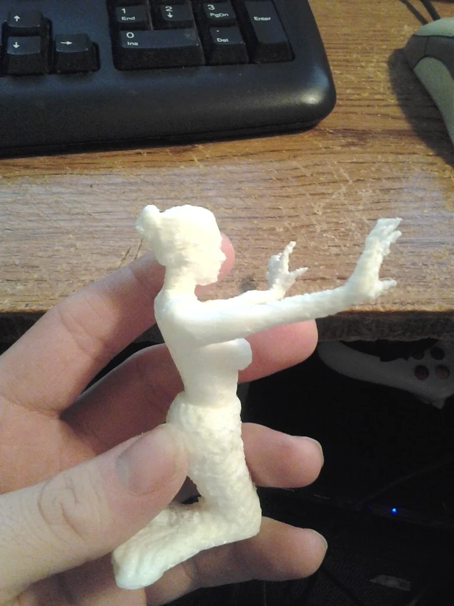

import Media from "../../../../components/aside_media/aside_media.astro";

<Media src="img_1.png" alt="Mermaid" side="left">

*Note: Many years ago (around 2012) I became involved with the early 3D printing community and, as a result, created a number of 3D models.
I used to share highlights from those projects on my legacy blog, but I’ve decided to migrate some of that content here to help reconcile and preserve it.*

{class="img-right" style="max-height:300px;"}
From time to time, I share my 3D models on [Thingiverse][Thingiverse], and this is one of those pieces.

This particular model was created by combining several existing [Thingiverse][Thingiverse] models by [Cerberus333][Cerberus333], [Prattotyper][Prattotyper], [Nicholasclewis][Nicholasclewis], [RichRap][RichRap], and
[Friends][Friends] into a new merman design.

The project was primarily an exercise in learning Blender (specifically how to edit, merge, and create models) and
it serves as a complementary piece to my [merman model][merman].

[Download from Thingiverse here][ThingiverseDownload]

Enjoy!

</Media>

[Thingiverse]: http://www.thingiverse.com
[ThingiverseDownload]: https://www.thingiverse.com/thing:37256
[Cerberus333]: http://www.thingiverse.com/cerberus333/designs
[Prattotyper]: http://www.thingiverse.com/nicholasclewis/designs
[Friends]: http://www.thingiverse.com/Friends/designs
[RichRap]: https://www.thingiverse.com/RichRap/designs
[Nicholasclewis]: https://www.thingiverse.com/nicholasclewis/designs
[merman]: /thingiverse/2012-12-18-thingiverse-model-the-merman/