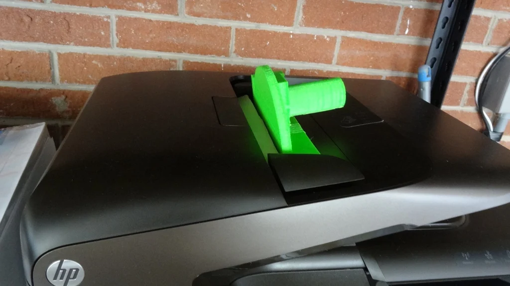
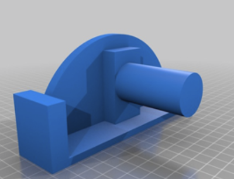

import Media from "../../../../components/aside_media/aside_media.astro";

<Media src="img_1.png" alt="wolf dog" side="left">

*Note: Many years ago (around 2012) I became involved with the early 3D printing community and, as a result, created a number of 3D models.
I used to share highlights from those projects on my legacy blog, but I’ve decided to migrate some of that content here to help reconcile and preserve it.*

{class="img-right" style="max-height:300px; max-width:300px;"}
From time to time, I share my 3D models on [Thingiverse][Thingiverse], and this is one of those pieces.

This design is a food or object pusher (for example, paper) that was originally created to replace a missing food pusher for a meat slicer.
During preliminary testing, however, I discovered an unexpected secondary use: it functions exceptionally well as a feeder pusher for loose pages 
that have been cut from a book spine and fed directly into an HP automatic document scanner.

To elaborate, most automatic document scanners intentionally kick the paper stack away from the feeder input to ensure that only
a single page is grabbed at a time. The added cross-sectional mass of this model helps keep the pages flush against the 
feeder input without causing jams, even when the feeder briefly pushes the stack away to acquire the next page.

---
{class="img-left" style="max-height:300px; max-width:300px;"}

**Disclaimer:**
When it comes to food-related applications, you can never be too careful.

Before using this model with food, be sure to research the specific type of plastic you plan to use and determine whether 
it is safe for food contact. While ABS plastic is commonly used in many food-related applications and is often considered 
safe for eating or drinking from, there are multiple grades of ABS. Some are food-safe, while others are not.

Additionally, 3D printers tend to leave microscopic gaps and pits in printed parts. These imperfections can allow 
bacteria to grow in areas that are difficult or impossible to properly sterilize. For this reason, it is strongly 
recommended to apply a food-safe sealant when using food-safe plastics in food applications.

[Download from Thingiverse here][ThingiverseDownload]

Enjoy!
</Media>

[Thingiverse]: http://www.thingiverse.com
[ThingiverseDownload]: https://www.thingiverse.com/thing:59442
