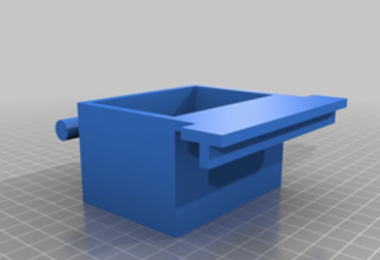

import Media from "../../../../components/aside_media/aside_media.astro";

<Media src="img_1.png" alt="Bird" side="left" img_x_offset="-350px">

*Note: Many years ago (around 2012) I became involved with the early 3D printing community and, as a result, created a number of 3D models.
I used to share highlights from those projects on my legacy blog, but I’ve decided to migrate some of that content here to help reconcile and preserve it.*

{class="img-right" style="max-height:300px; max-width:300px;"}
From time to time, I share my 3D models on [Thingiverse][Thingiverse], and this is one of those pieces.

Let’s face it birds love to file their beaks by chewing on things, and my pet bird could put a termite to shame in sheer
destructive prowess. I’ve seen books turned into pulp, beak stones obliterated, and perches chewed into mulch.
Recently, however (to my misfortune), she appears to have developed a taste for the exotic and decided that her
oddly shaped food and water dish --- an item for which no replacement seems to exist --- looked especially scrumptious.

As she continues working her way through the current dish, I decided to get ahead of the inevitable and design a 
replacement of my own. Since others might find it useful as well, I figured I’d share the results.

---
{class="img-left" style="max-height:300px; max-width:300px;"}

**Disclaimer:**
When it comes to food-related applications, you can never be too careful.

Before using this model with food or water, please research the specific type of plastic you plan to use and verify 
that it is safe for food contact. Based on the information I’ve found, ABS plastic is commonly used in many 
food-related applications and is often considered safe for eating or drinking from. However, there are multiple 
grades of ABS --- some are food-safe, while others are not.

Additionally, 3D printing can leave microscopic gaps and pits in printed parts. These imperfections can 
harbor bacteria in areas that are difficult or impossible to properly sterilize. For this reason, using a food-safe 
sealant on food-safe plastics is strongly recommended.

**Also Important:**

If you intend to use this item as a replacement bird dish, keep in mind that birds enjoy tearing things apart and 
3D-printed parts may sometimes have stringing or sharp microscopic filaments remaining on the surface after printing.
Extra care should be taken to thoroughly clean and finish the model through sanding, heat smoothing, or 
similar methods to ensure a solid, smooth surface.

While techniques such as sandblasting or a hot rinse may help achieve this, I have not personally tested those methods.
These factors should be carefully considered before using the printed part with a live animal.

[Download from Thingiverse here][ThingiverseDownload]

Enjoy!
</Media>

[Thingiverse]: http://www.thingiverse.com
[ThingiverseDownload]: https://www.thingiverse.com/thing:59467
