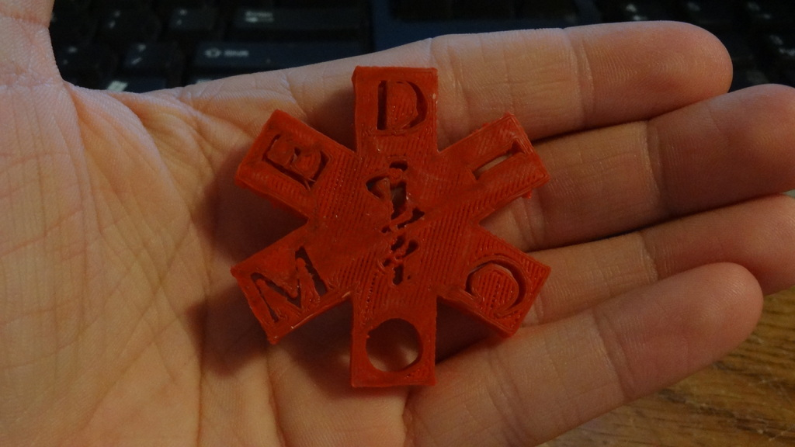
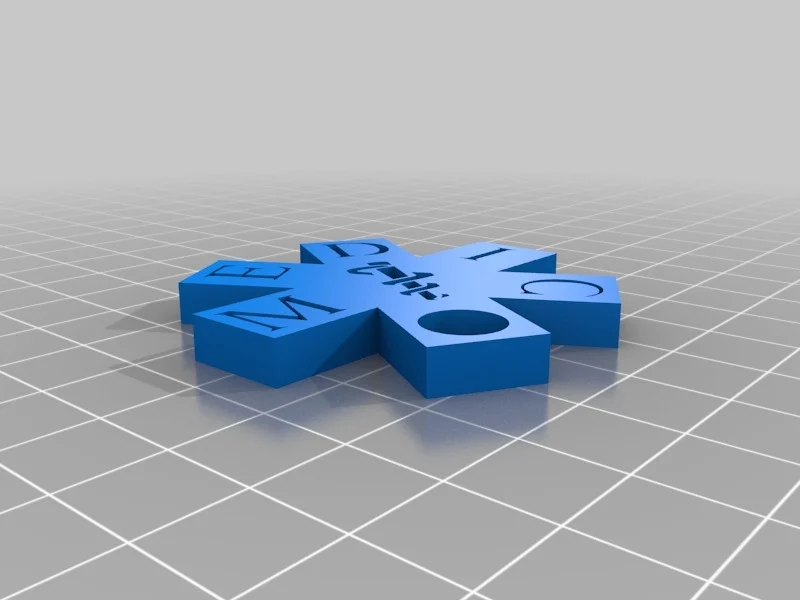

import Media from "../../../../components/aside_media/aside_media.astro";

<Media src="img_1.png" alt="EMS" side="left">

*Note: Many years ago (around 2012) I became involved with the early 3D printing community and, as a result, created a number of 3D models.
I used to share highlights from those projects on my legacy blog, but I’ve decided to migrate some of that content here to help reconcile and preserve it.*

{class="img-left" style="max-height:300px; max-width:300px;"}
From time to time, I share some of the 3D models I create on [Thingiverse][Thingiverse], and this is one of those models.

This design is a Star of Life keychain pendant, based on the symbol commonly used to represent emergency medical services (EMS).

This model is dedicated to the men and women around the world who devote their lives to the protection and preservation of human health --- often at great personal risk.

The model was designed to be versatile and can be used as a keychain pendant, wall ornament, car ornament, or incorporated into other 3D projects. It is provided in several variations:

{class="img-right" style="max-height:300px; max-width:300px;"}

* Base version - An unadorned Star of Life.
* Embossed text version - The Star of Life with the word “medic” embossed on the surface.
* Cutout text version - The Star of Life with the word “medic” removed from within the star.
* Symbol cutout version - The Star of Life with the Rod of Asclepius removed.
* Keychain variant - The Star of Life with both the Rod of Asclepius and the “medic” text removed, designed specifically for use as a keychain pendant.

---

[Download from Thingiverse here][ThingiverseDownload]

Enjoy!
</Media>

[Thingiverse]: http://www.thingiverse.com
[ThingiverseDownload]: https://www.thingiverse.com/thing:68728
